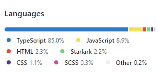

# 앵귤러 느슨하게 배우기

앵귤러를 사용하면서 느낌점들을 통해 도움이 될만한 내용을 공유하려고 합니다. 제가 말하는 내용은 정답이 아니며 앵귤러 공식문서에 나와있는 커리큘럼과는 거리가 멉니다. 앵귤러를 배우는 단계라면 참고할만한 내용들을 다루려고 하며 도움이 되었다면 좋겠습니다.

### 앵귤러의 장점은 본인 스스로 찾아야 합니다.

앵귤러는 흔히 프론트엔드 3대장이라 불리는 리액트, 뷰에 비해 인기도가 낮습니다. 때문에 처음부터 앵귤러를 배우는 개발자들보다는 리액트, 뷰를 한번쯤은 맛본 개발자들이 회사가 앵귤러를 사용한다는 이유로 배우게 되는 경우가 많이 있는 것 같습니다.

저 역시 시작은 리액트였고 한동안 애정했습니다. 회사에서 앵귤러를 배워야 되는 상황에 마주하고 힘들어하며 몇달동안은 회사에서는 앵귤러로 개발을 진행했지만, 집에 와서는 리액트로 제 프로젝트를 진행하기도 했던거 같아요.

앵귤러는 대부분 그런 입장이기 때문에, 앵귤러를 배워야한다면 본인 스스로 앵귤러에 대한 장점들을 찾아서 조금이나마 적적한 마음을 달래야 합니다.

저는 앵귤러를 좋아하지만 열렬한 팬은 아닙니다. 단순히 프론트엔드 진영에서 거의 찾아 볼 수 없는 class 기반의 객체지향 프로그래밍이 가능한 프레임워크라는 이유로 앵귤러에 매력을 느꼈습니다.  이 장점은 누군가에겐 단점이 될 수도 있고, 크게 매력을 느끼지 못하는 부분일 수 있습니다.

저 역시 처음부터 이러한 부분에 끌린게 아니였고, 공부하면서 타당한 이유를 찾아야 했기에 제가 만든 장점이라고 할 수 있겠네요.

글을 보시는 분들로 하여금 앵귤러에 대한 학습 동기를 유지하고, 다른 기술을 메인으로 사용하시더라도 같이 사용할 수 있게 하는 것이 저의 목표입니다. 인터넷에서 이미 많은 정보를 접하셨겠지만, 약을 좀 팔아서 조금이나마 불편한 마음이 완화게 되길 바랍니다..ㅎ

* (앵귤러 1은 이제 앵귤러로 안칩니다) 앵귤러는 프로젝트의 대부분의 코드가 타입스크립트로 만들어 졌기 때문에 타입스크립트로 코드를 치는 환경이 매우 잘 구성되어 있습니다. 이는 태생이 자바스크립트로 만들어진 리액트와 제일 비교되는 부분입니다. 타입스크립트는 만능이 아닙니다. 장점이 있다면 단점도 있겠죠. 하지만, 코드를 작성하는 단계에서 미리 타입 안전성에 대한 피드백을 받아볼 수 있다는 측면에서 런타임에 일어날 버그들을 어느정도 완화 해준다는 매리트는 크게 작용합니다. 이런 타입스크립트 환경이 가장 잘 어울리는게 앵귤러이지 않을까 조심스럽게 생각해봅니다.

<figure><figcaption>
Angular Git
</figcaption></figure>

<figure><figcaption>
React Git
</figcaption></figure>

* 앵귤러가 타 프레임워크에 비해 인기도가 낮다라고 표현하였지만, 프론트엔드 생태계의 수많은 프레임워크중에서는 반대로 유명한 프레임워크라고 말할 수도 있죠. 말이 많았지만 어느덧 17 버전까지 올라오면서 계속해서 발전하는 모습을 보여주고 있고, 앵귤러 역시 많은  엔터프라이즈 환경에서 사용되고 있습니다.
*   앵귤러는 객체지향 프로그래밍이라는 전통적인 개발 방식을 채택하고 있습니다. 일부에서는 프론트엔드 개발에 있어서 앵귤러의 접근 방식이 지나치게 복잡하다고 여겨질 수 있지만, 현대의 프론트엔드 개발은 백엔드와 견줄 만큼 방대한 코드를 요구하는 추세입니다. 이러한 상황에서 코드 관리에 대한 고민이 필수적으로 따르게 되며, 다양한 프로그래밍 패러다임을 알고 이해하는 것이 큰 도움이 됩니다.

    객체지향 프로그래밍에 대한 이해와 숙련도가 있다면, 단순히 클래스(class) 기반의 개발뿐만 아니라 함수(function)를 중심으로 하는 개발 환경에서도 유사한 기술과 원리를 재해석하고 적용하는 능력을 기를 수 있습니다. 이런 점에서 앵귤러를 사용하는 것은 프로그래밍 패러다임과 다양한 기술에 대한 이해를 넓힐 수 있는 좋은 기회가 될 수 있습니다.&#x20;

저 역시 부족한 부분이 많고 아직도 계속 배우는 입장이고 주 관심사가 프로그래밍 패러다임과 아키택처적인 부분이기 때문에 프론트엔드에서 이런 경험을 할 수 있다는 것은 아주 괜찮은 일이라고 ~~약을 팔 예정입니다.~~ 말하고 싶습니다.
